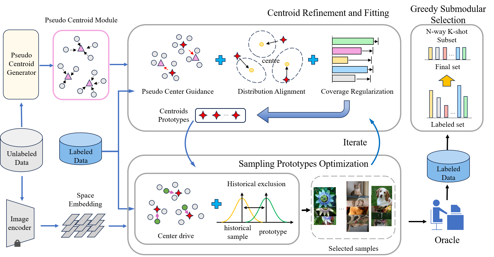

# Prototype-Centroid Collaboration for Budget-Aware Few-Shot Sample Selection
### Overview

### Introduction

In practical few-shot learning scenario, it is often necessary to manually annotate a balanced subset of samples with equal number per class from a large pool of unlabeled data. However, most existing approaches implicitly assume access to fully labeled datasets, while traditional active learning methods are not inherently designed to operate under the strict \(N\)-way \(K\)-shot settings, thus limiting their effectiveness in this condition. To bridge this gap, we propose a novel sample selection framework based on a centroid-prototype collaborative strategy, which facilitates efficient and class-balanced sample acquisition under constrained annotation budgets. Furthermore, we introduce a new task formulation that explicitly models the sample selection process under few-shot learning constraints, enabling principled evaluation and method development in this context. Extensive experiments demonstrate that our method not only operates effectively under low-budget conditions but also outperforms conventional baselines when full supervision is available.

